# Итоговая работа

## 1. Цель работы

Целью итоговой работы является объединение разработанных компонентов в единое FastAPI-приложение для управления пользователями, тренировками, упражнениями и мышечными группами. В работе проверяется корректность CRUD-операций, связей между сущностями и работы API через Swagger.

## 2. Структура приложения

В приложении реализованы следующие основные сущности:

* **User** — пользователь системы;
* **Workout** — тренировка пользователя;
* **Exercise** — упражнение, входящее в тренировку;
* **MuscleGroup** — мышечная группа;
* **ExerciseMuscleGroupLink** — промежуточная таблица для связи упражнений и мышечных групп.

Основная связь между сущностями имеет следующий вид:

**User → Workout → Exercise**

Для упражнений и мышечных групп реализована связь **M:N**, поскольку одно упражнение может относиться к нескольким мышечным группам, а одна мышечная группа может быть связана с несколькими упражнениями.

## 3. Запуск и проверка API

После запуска приложения FastAPI API становится доступным через Swagger по адресу:

`http://127.0.0.1:8000/docs`

В Swagger представлены группы методов для пользователей, тренировок, упражнений, мышечных групп и связи между упражнениями и мышечными группами.

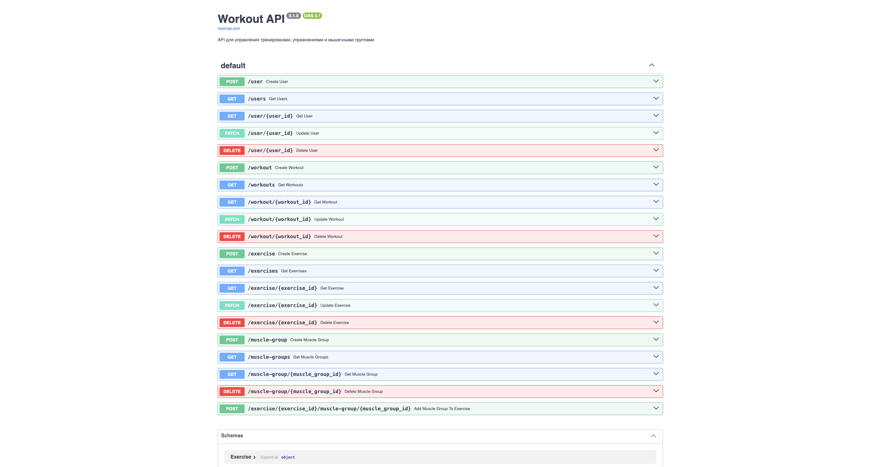

**Рисунок 1 — Swagger-документация разработанного API.**

## 4. Работа с пользователями

Для проверки API был создан пользователь с помощью метода `POST /user`.

В качестве данных были указаны имя «Зарина», возраст 20 лет, вес 55 кг, рост 165 см и уровень 2. В результате сервер вернул статус `200` и автоматически присвоил пользователю идентификатор `3`.

**Рисунок 2 — Создание пользователя с помощью POST /user.**

После создания пользователя был выполнен запрос `GET /users`. В результате API вернул список пользователей, включая созданного пользователя с `id = 3`.

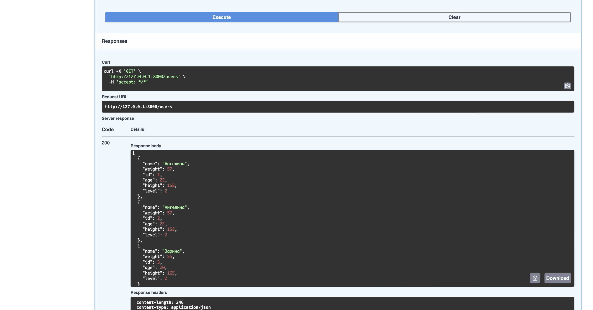

**Рисунок 3 — Получение списка пользователей.**

Для проверки получения отдельной записи был выполнен запрос `GET /user/{user_id}` с идентификатором `3`.

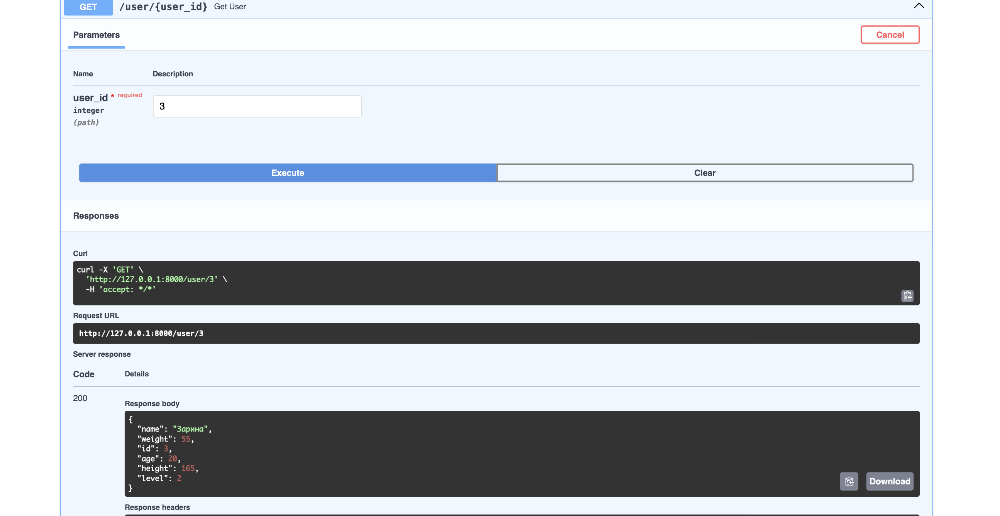

**Рисунок 4 — Получение пользователя по идентификатору.**

Для проверки изменения данных был использован метод `PATCH /user/{user_id}`. Уровень пользователя был изменён с `2` на `3`.

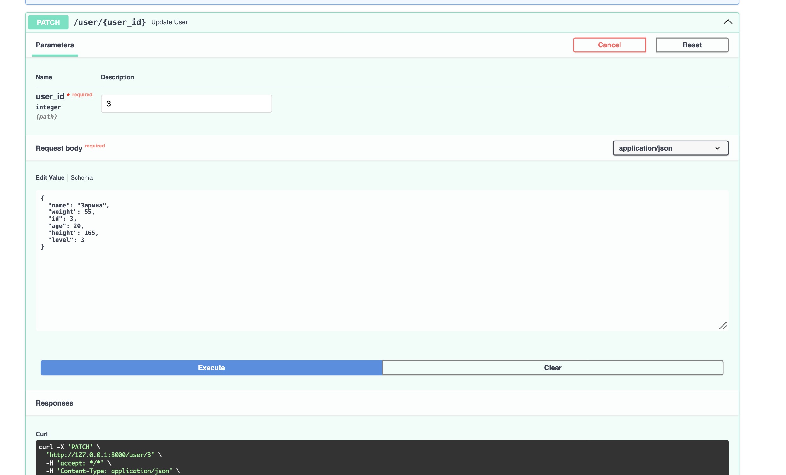

**Рисунок 5 — Изменение данных пользователя.**

## 5. Работа с тренировками

Для пользователя с `id = 3` была создана тренировка с помощью `POST /workout`.

В тренировке указаны категория «силовая», название «Тренировка ног», дата `2026-10-01`, продолжительность 60 минут и связь с пользователем через `user_id = 3`.

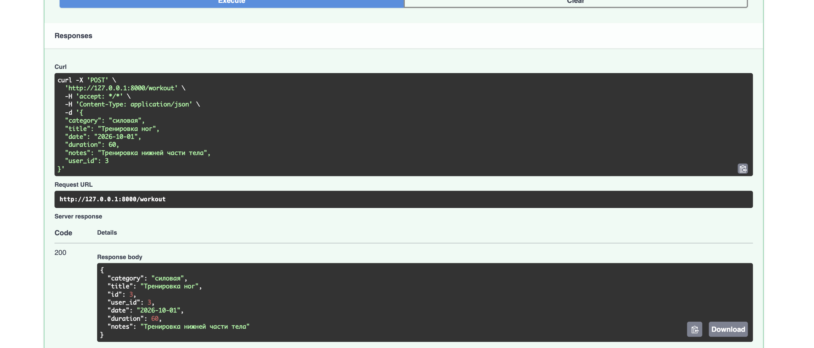

**Рисунок 6 — Создание тренировки.**

С помощью `GET /workouts` был получен список тренировок. Созданная тренировка присутствует в списке и связана с пользователем `id = 3`.

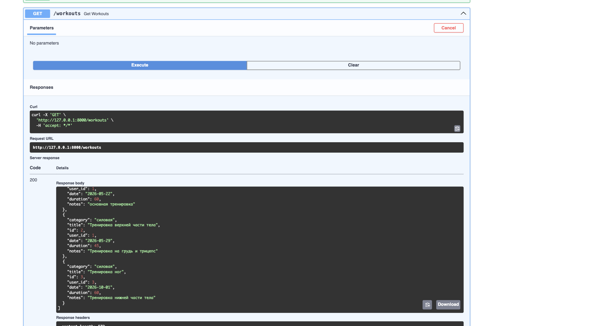

**Рисунок 7 — Получение списка тренировок.**

## 6. Работа с упражнениями

Для созданной тренировки было добавлено упражнение «Приседания». Упражнение содержит 3 подхода по 12 повторений с весом 30 кг и связано с тренировкой `id = 3`.

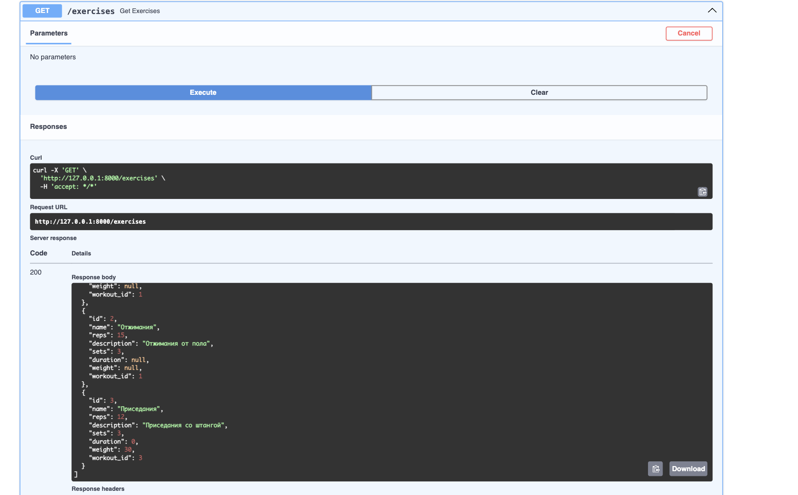

**Рисунок 8 — Получение списка упражнений.**

## 7. Связь упражнений и мышечных групп

Для проверки связи M:N была создана мышечная группа «Квадрицепс» с описанием «Передняя группа мышц бедра».

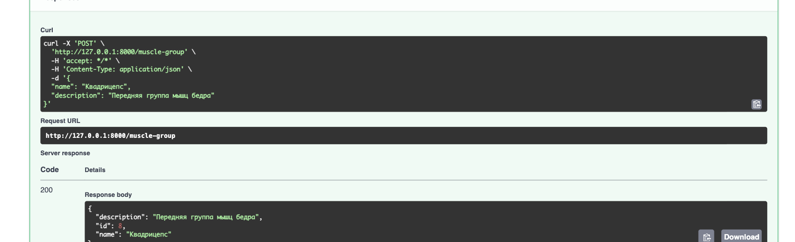

**Рисунок 9 — Создание мышечной группы.**

После этого упражнение «Приседания» (`id = 3`) было связано с мышечной группой «Квадрицепс» (`id = 8`). Для связи было установлено значение `level = 1`.

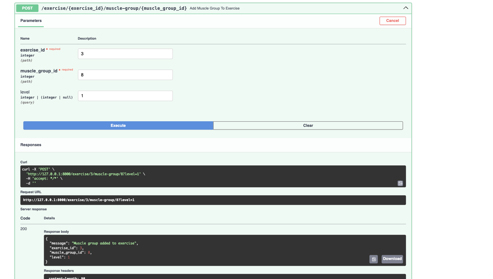

**Рисунок 10 — Добавление мышечной группы к упражнению.**

Корректность связи была дополнительно проверена с помощью `GET /exercise/3`. В результате в поле `muscle_groups` появилась мышечная группа «Квадрицепс» с установленным уровнем связи.

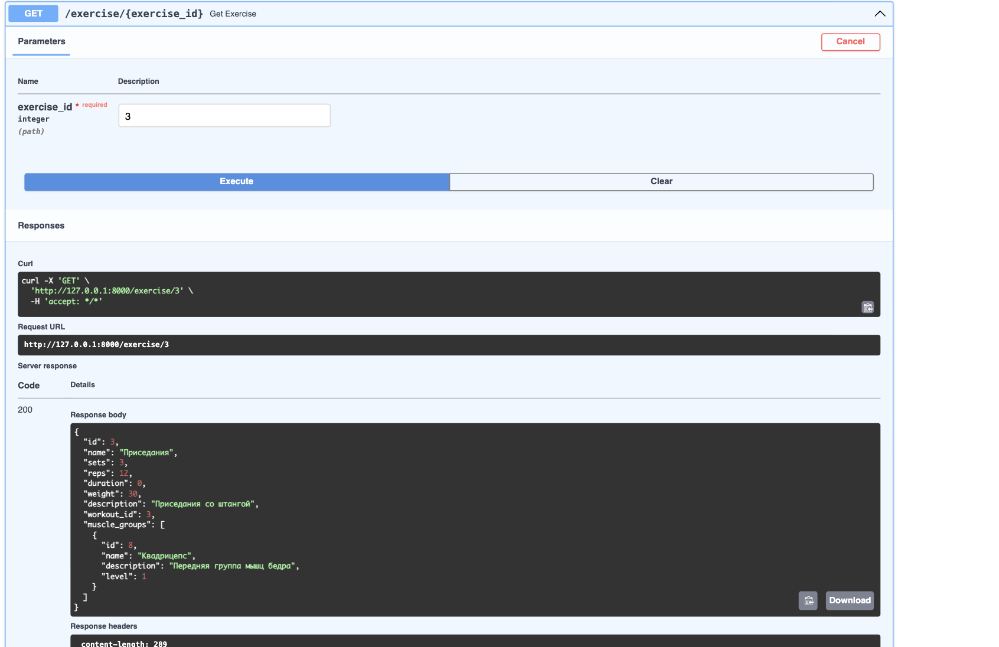

**Рисунок 11 — Получение упражнения вместе со связанной мышечной группой.**

Также был выполнен `GET /muscle-groups`, который подтвердил наличие созданной мышечной группы в базе данных.

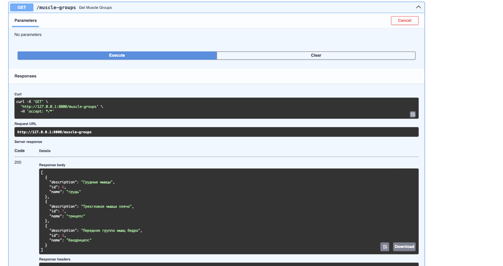

**Рисунок 12 — Получение списка мышечных групп.**

## 8. Проверка удаления данных

При первоначальной проверке удаления пользователя `id = 3` сервер вернул ошибку `500`, поскольку пользователь был связан с тренировкой, а тренировка — с упражнением.

Для корректной обработки удаления была изменена логика метода `DELETE /user/{user_id}`. Перед удалением пользователя удаляются связанные упражнения, связи упражнений с мышечными группами и тренировки.

После внесения изменений повторный запрос `DELETE /user/3` завершился успешно со статусом `200`.

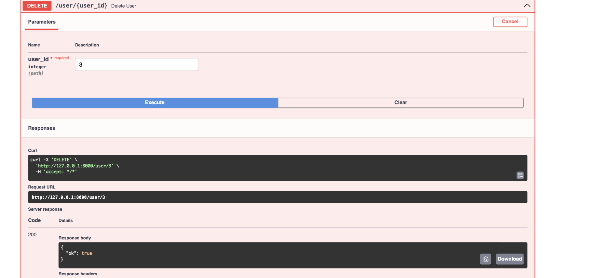

**Рисунок 13 — Удаление пользователя и связанных данных.**

После удаления был повторно выполнен `GET /users`. Пользователь с `id = 3` отсутствует в полученном списке, что подтверждает успешное удаление.

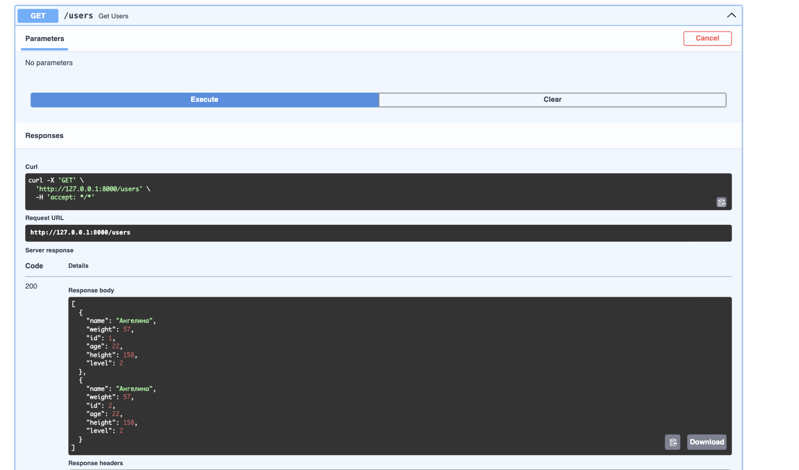

**Рисунок 14 — Проверка отсутствия удалённого пользователя.**

## 9. Вывод

В ходе итоговой работы было проверено функционирование разработанного FastAPI-приложения. Были протестированы основные CRUD-операции для пользователей, тренировок, упражнений и мышечных групп.

Также была проверена связь M:N между упражнениями и мышечными группами с использованием промежуточной таблицы `ExerciseMuscleGroupLink` и дополнительного поля `level`.

Дополнительно была проверена обработка удаления связанных объектов. После изменения логики удаления пользователь и связанные с ним данные корректно удаляются из базы данных.

Таким образом, разработанный API позволяет создавать, получать, изменять и удалять основные сущности приложения, а также работать с установленными между ними связями.
