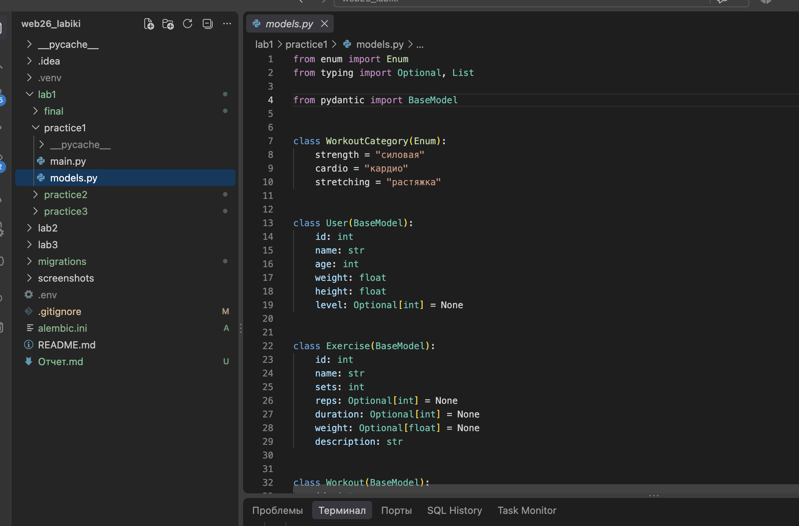
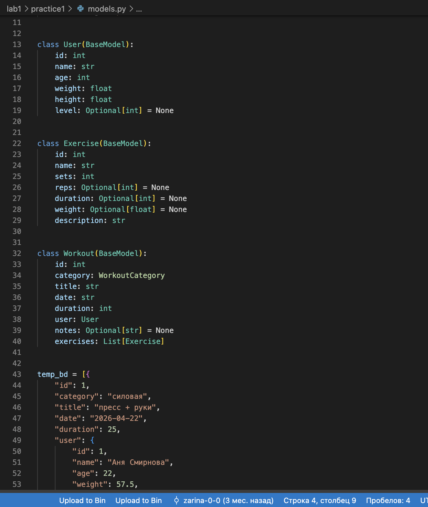
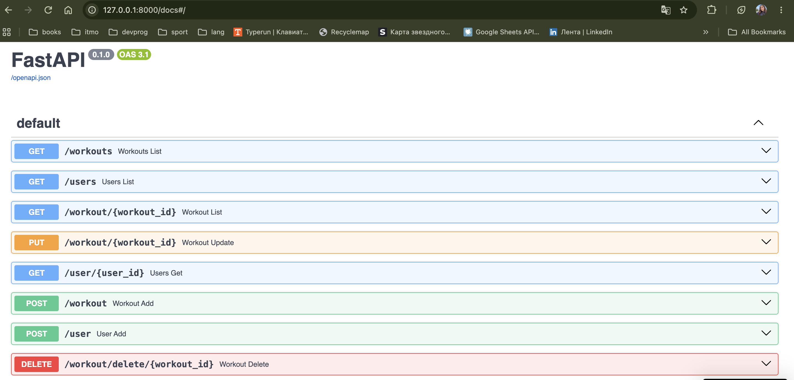
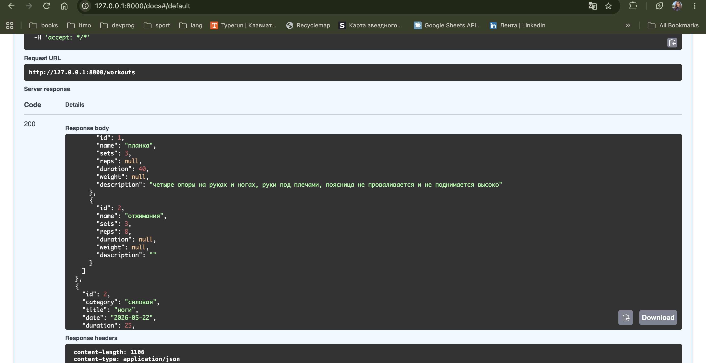

## Практика 1.1. Основы FastAPI

### Цель работы

Цель работы — познакомиться с фреймворком FastAPI, создать серверное приложение на Python, описать модели данных и реализовать основные HTTP-эндпоинты.

### 1. Создание проекта

Для выполнения практической работы был создан проект на Python с использованием виртуального окружения `.venv`.

Для первой практики была создана отдельная директория `lab1/practice1`, содержащая файлы `main.py` и `models.py`.

**Рисунок 1 — Структура проекта**



### 2. Создание моделей данных

В файле `models.py` были описаны Pydantic-модели предметной области: `User`, `Exercise` и `Workout`.

Модель `Workout` содержит вложенные объекты пользователя и список упражнений. Для категорий тренировок используется перечисление `WorkoutCategory`.

Также на данном этапе для хранения данных использовались временные структуры `temp_bd` и `users_bd`.

**Рисунок 2 — Модели данных**



### 3. Реализация API

В файле `main.py` было создано FastAPI-приложение:

```python
app = FastAPI()
```

Для работы с данными были реализованы HTTP-эндпоинты:

| Метод  | Эндпоинт                       | Назначение                               |
| ------ | ------------------------------ | ---------------------------------------- |
| GET    | `/workouts`                    | получение списка тренировок              |
| GET    | `/users`                       | получение списка пользователей           |
| GET    | `/workout/{workout_id}`        | получение тренировки по идентификатору   |
| GET    | `/user/{user_id}`              | получение пользователя по идентификатору |
| POST   | `/workout`                     | добавление тренировки                    |
| POST   | `/user`                        | добавление пользователя                  |
| PUT    | `/workout/{workout_id}`        | изменение тренировки                     |
| DELETE | `/workout/delete/{workout_id}` | удаление тренировки                      |

Таким образом, были реализованы операции получения, создания, изменения и удаления данных.

### 4. Документация Swagger UI

После запуска приложения FastAPI автоматически сформировал интерактивную документацию Swagger UI.

В документации отображаются все реализованные эндпоинты, их HTTP-методы, параметры запросов и схемы данных.

**Рисунок 3 — Swagger UI с реализованными эндпоинтами**



### 5. Проверка получения данных

Для проверки работы API был выполнен запрос `GET /workouts`.

В результате сервер вернул список тренировок со статусом `200 OK`. Ответ содержит информацию о тренировке, пользователе и входящих в неё упражнениях.Например, первая тренировка имеет категорию «силовая», название «пресс + руки», длительность 25 минут и содержит два упражнения: планку и отжимания. Таким образом, результат запроса демонстрирует также работу с вложенными объектами.

**Рисунок 4 — Результат выполнения GET /workouts**



### Результат работы

В итоге при выполнении практической работы было создано серверное приложение на FastAPI. Были разработаны Pydantic-модели для пользователей, тренировок и упражнений, реализованы HTTP-эндпоинты для работы с данными и выполнена проверка API через Swagger UI.
На данном этапе данные хранились во временных структурах Python. В следующих практических работах приложение будет дополнено подключением PostgreSQL, SQLModel и системой миграций Alembic.
