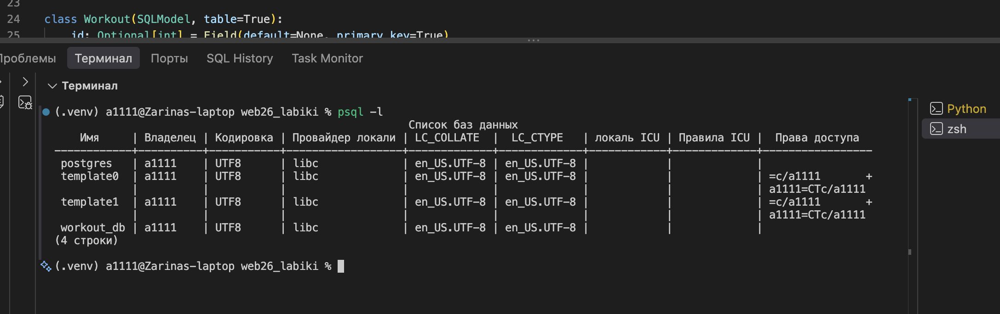
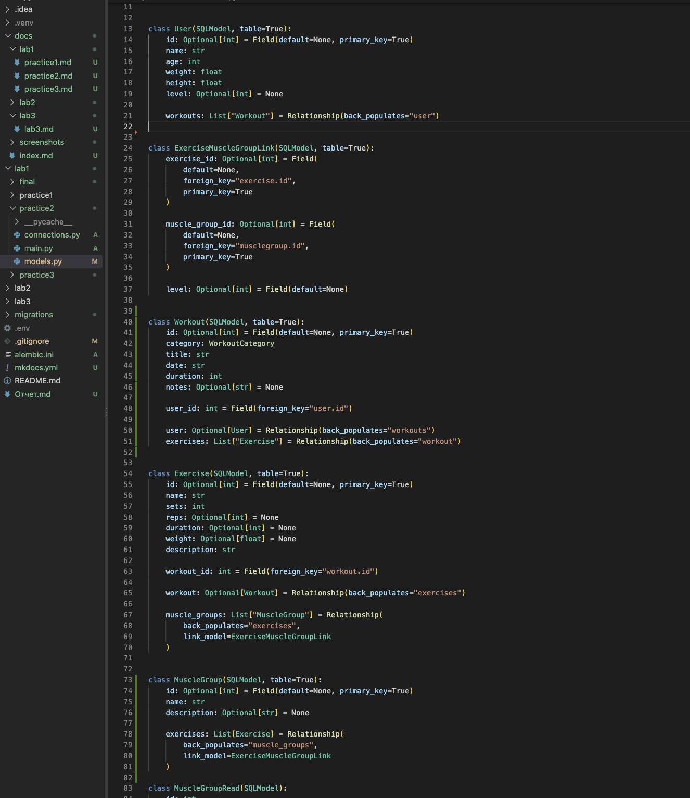
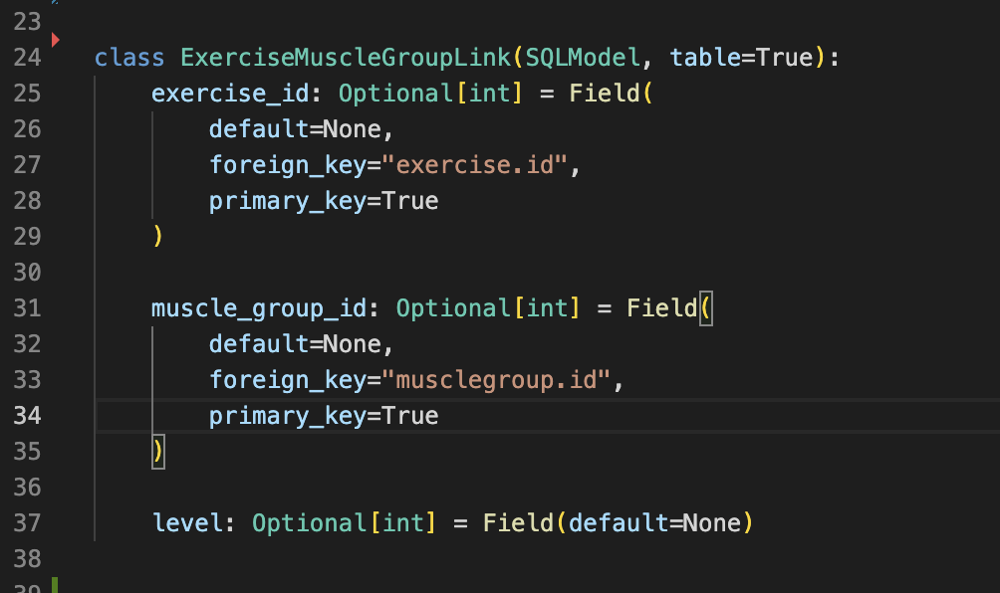
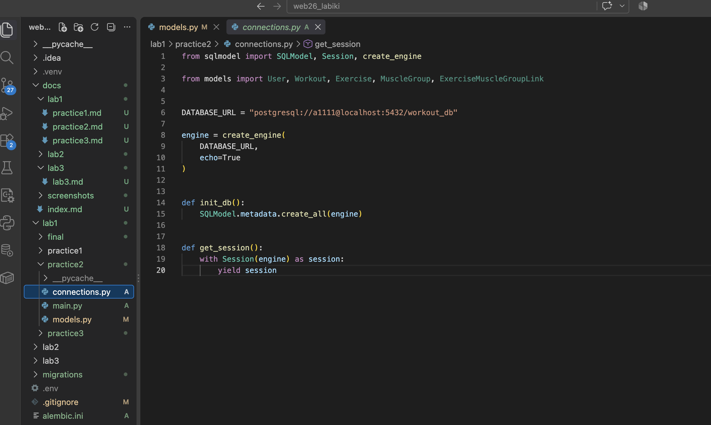
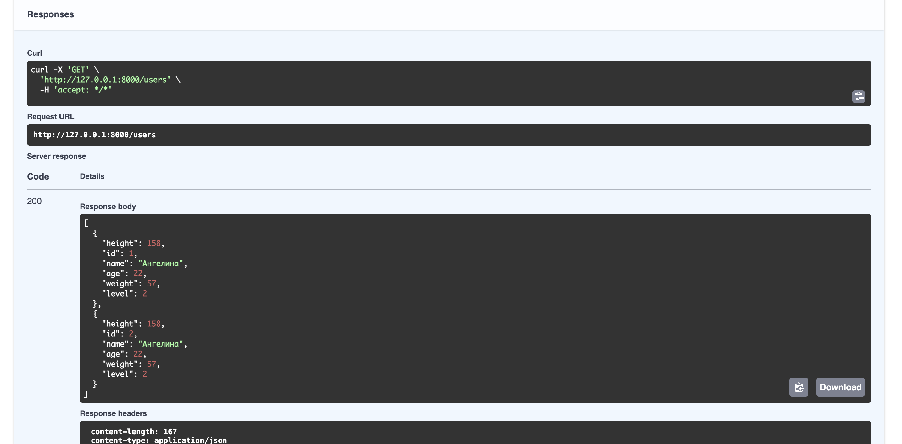
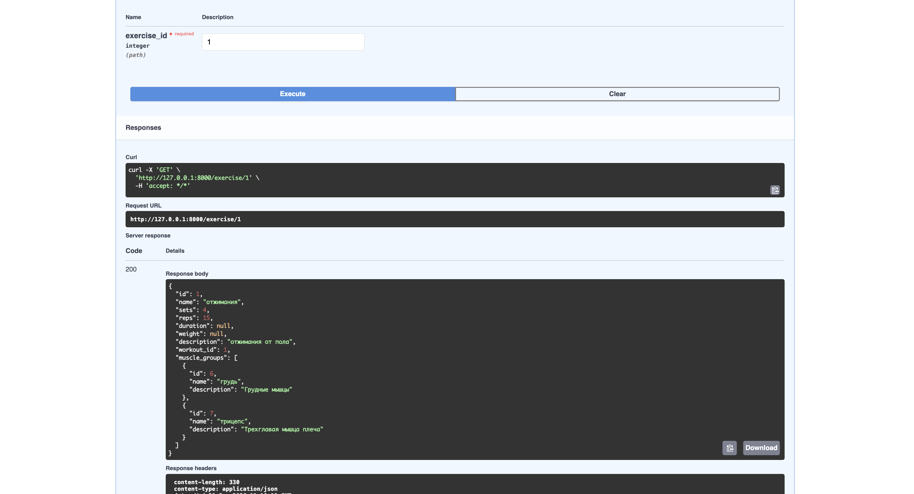

## Практика 1.2. Настройка БД, SQLModel и работа с PostgreSQL

### Цель работы

Цель работы — подключить PostgreSQL к разработанному FastAPI-приложению, заменить временное хранение данных на работу с реальной базой данных, использовать SQLModel для описания таблиц и реализовать взаимодействие с базой данных через сессии.

В рамках практической работы также были реализованы связи между таблицами, включая отношения «один-ко-многим» и «многие-ко-многим».

### 1. Подключение PostgreSQL

Для хранения данных была создана база данных PostgreSQL `workout_db`.

Для взаимодействия Python-приложения с PostgreSQL были использованы библиотеки `SQLModel` и `psycopg2-binary`.

Проверка наличия базы данных была выполнена командой:

```bash
psql -l
```

В списке баз данных присутствует:

```text
workout_db
```

**Рисунок 5 — Проверка наличия базы данных PostgreSQL**



### 2. Создание моделей SQLModel

В отличие от первой практики, где использовались обычные Pydantic-модели и временные структуры Python, в данной работе модели были реализованы с использованием `SQLModel`.

Для создания таблиц в базе данных классы наследуются от `SQLModel` и имеют параметр `table=True`.

В проекте были созданы следующие основные сущности:

* `User` — пользователь;
* `Workout` — тренировка;
* `Exercise` — упражнение;
* `MuscleGroup` — группа мышц;
* `ExerciseMuscleGroupLink` — ассоциативная таблица для связи упражнений и групп мышц.

**Рисунок 6 — Модели SQLModel**



### 3. Связи между таблицами

В проекте были реализованы связи нескольких типов.

Между пользователем и тренировками используется связь **один-ко-многим**: один пользователь может иметь несколько тренировок.

Между тренировкой и упражнениями также реализована связь **один-ко-многим**: одна тренировка может содержать несколько упражнений.

Для связи упражнений с группами мышц используется отношение **многие-ко-многим**. Для его реализации создана промежуточная таблица `ExerciseMuscleGroupLink`.

Схематично структура связей имеет следующий вид:

```text
User
 │
 │ 1:N
 ▼
Workout
 │
 │ 1:N
 ▼
Exercise
 │
 │ M:N
 ▼
MuscleGroup
```

Ассоциативная таблица также содержит дополнительное поле `level`, которое позволяет хранить дополнительную информацию о связи упражнения с группой мышц.

**Рисунок 7 — Реализация связей между моделями**



### 4. Подключение приложения к базе данных

Для подключения к PostgreSQL был создан файл `connections.py`.

В нём формируется подключение к базе данных с помощью `create_engine`, а объект `Session` используется для выполнения операций с данными.

Также была реализована функция `get_session()`, которая передаёт сессию базы данных в API-методы приложения.

Таким образом, вместо временных списков из Практики 1.1 приложение теперь работает непосредственно с PostgreSQL.

**Рисунок 8 — Подключение SQLModel к PostgreSQL**



### 5. Работа с данными через API

После перехода на SQLModel эндпоинты приложения были изменены для работы с реальной базой данных.

Для получения данных используется объект сессии и запросы `select`.

Для создания записи объект добавляется в сессию с помощью `session.add()`, после чего изменения сохраняются методом `session.commit()`.

После создания записи используется `session.refresh()`, чтобы получить актуальные данные объекта из базы.

Для обновления данных используется частичное изменение объекта через PATCH-запрос. Перед обновлением выполняется проверка существования записи.

Для удаления используется `session.delete()` с последующим сохранением изменений через `session.commit()`.

### 6. Проверка CRUD-операций

Работа API была проверена через Swagger UI.

Были проверены операции создания, получения, изменения и удаления пользователей и тренировок.

Например, после создания пользователя запрос `GET /users` возвращает данные, полученные непосредственно из PostgreSQL.

**Рисунок 9 — Получение данных из PostgreSQL через API**



### 7. Проверка связи «многие-ко-многим»

Для проверки связи между упражнениями и группами мышц было создано упражнение и установлены связи с несколькими группами мышц.

Для упражнения «отжимания» были добавлены группы мышц:

* «грудь» — `level = 1`;
* «трицепс» — `level = 2`.

При получении упражнения через API связанные группы мышц отображаются вложенно.

Пример результата:

```json
{
  "id": 1,
  "name": "отжимания",
  "sets": 4,
  "reps": 15,
  "description": "отжимания от пола",
  "workout_id": 1,
  "muscle_groups": [
    {
      "id": 6,
      "name": "грудь",
      "description": "Грудные мышцы",
      "level": 1
    },
    {
      "id": 7,
      "name": "трицепс",
      "description": "Трехглавая мышца плеча",
      "level": 2
    }
  ]
}
```

Таким образом, результат демонстрирует работу связи «многие-ко-многим» и вложенное отображение связанных объектов.

**Рисунок 10 — Вложенное отображение групп мышц для упражнения**



### Результат работы

В результате выполнения практической работы приложение было переведено с временного хранения данных на работу с PostgreSQL.
С помощью SQLModel были описаны таблицы пользователей, тренировок, упражнений и групп мышц. Были реализованы связи «один-ко-многим» и «многие-ко-многим», а для последней создана отдельная ассоциативная таблица `ExerciseMuscleGroupLink` с дополнительным полем `level`.
Также были обновлены API-методы для выполнения CRUD-операций через сессии SQLModel. Работу API и вложенное отображение связанных объектов удалось проверить через Swagger UI.
