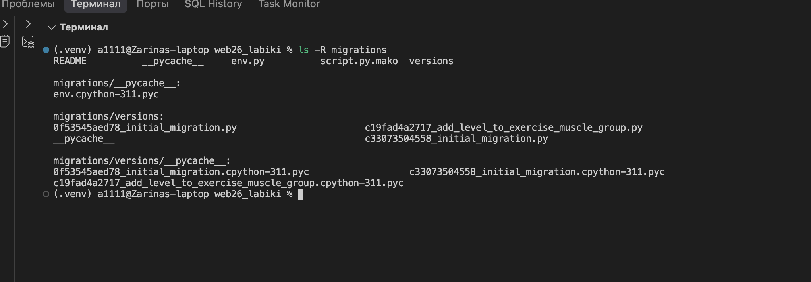
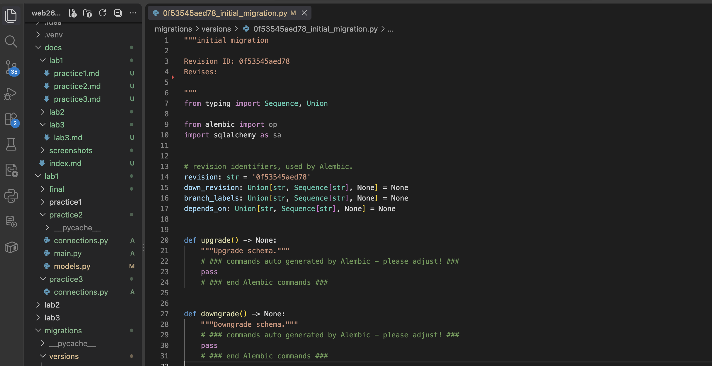
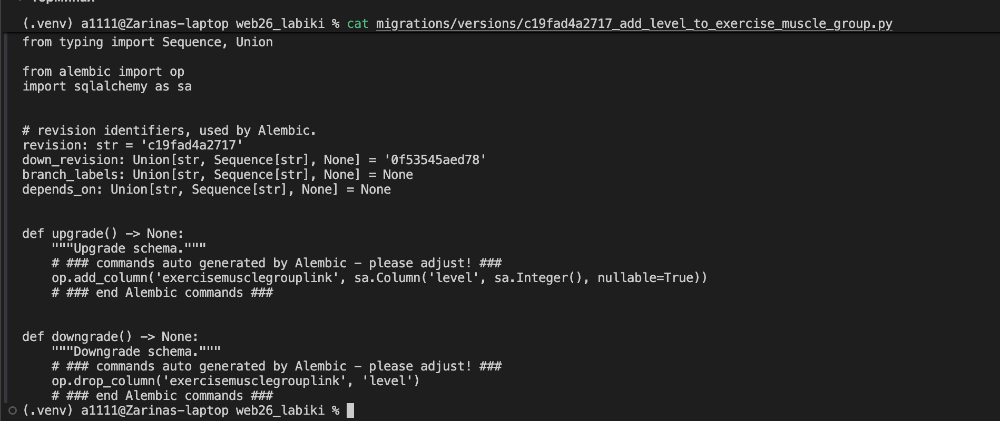
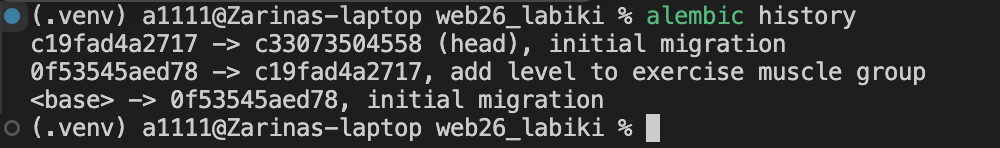
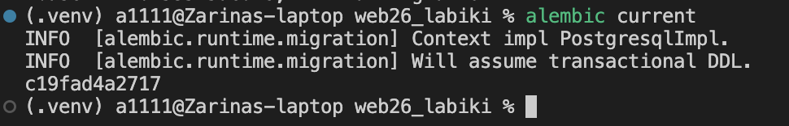
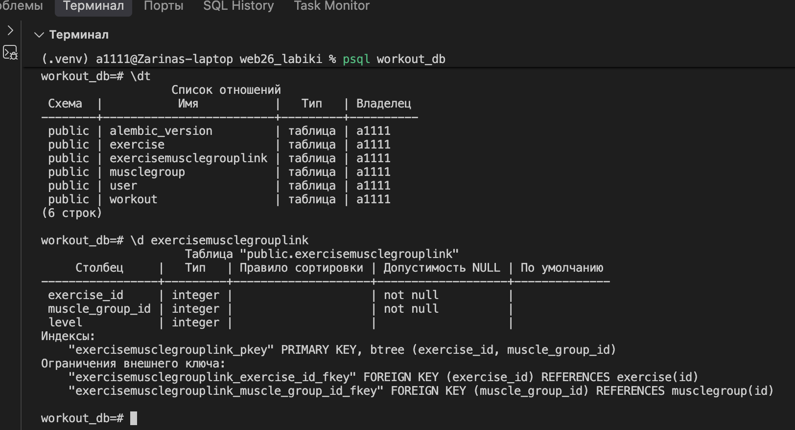

# Практика 1.3. Миграции базы данных через Alembic

## Цель работы

Цель практической работы — освоить работу с миграциями базы данных с использованием **Alembic**, научиться создавать и применять изменения структуры базы данных, а также проверять состояние миграций.

## Ход работы

В предыдущей практической работе была создана база данных `workout_db` для приложения учёта тренировок. В данной работе для управления изменениями структуры базы данных был настроен **Alembic**.

В проекте была создана структура миграций:

```text
migrations/
├── versions/
│   ├── 0f53545aed78_initial_migration.py
│   └── c19fad4a2717_add_level_to_exercise_muscle_group.py
├── env.py
├── README
└── script.py.mako
```



На первом этапе была создана начальная миграция, содержащая описание исходной структуры базы данных.



После изменения структуры модели была создана следующая миграция. Она добавляет поле `level` в таблицу связи между упражнениями и группами мышц.



### Проверка истории миграций

С помощью команды `alembic history` была проверена последовательность созданных миграций.



Команда `alembic current` позволила определить миграцию, которая в данный момент применена к базе данных.



### Проверка структуры базы данных

После применения миграций была выполнена проверка базы данных PostgreSQL. Команда `\dt` показала созданные таблицы, в том числе таблицу `exercisemusclegrouplink`.

Затем с помощью команды:

```sql
\d exercisemusclegrouplink
```

была просмотрена структура таблицы. В ней присутствует поле `level`, добавленное второй миграцией.



## Вывод

В ходе практической работы была освоена работа с Alembic для управления изменениями структуры базы данных. Были проверены история и текущая версия миграций, а также подтверждено применение изменений непосредственно в PostgreSQL. В результате была получена база данных с актуальной структурой, соответствующей моделям приложения.
