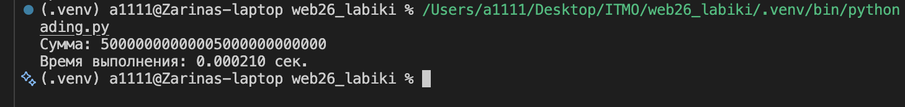
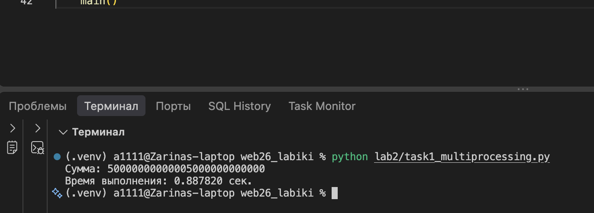
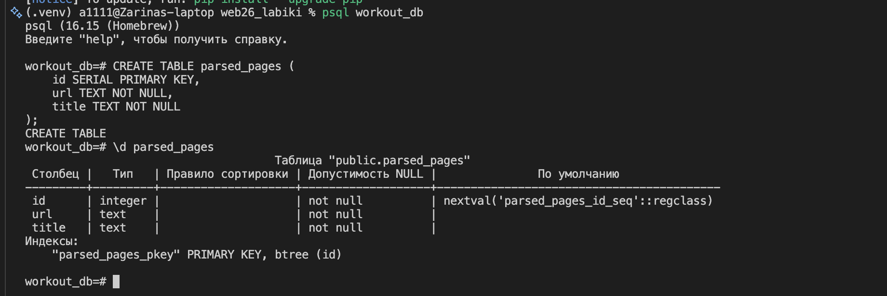
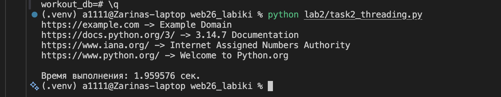
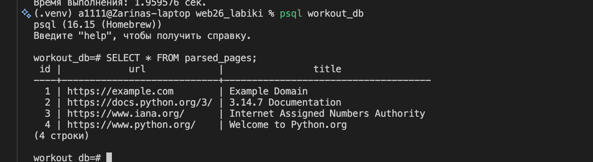
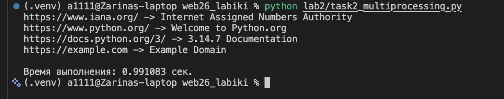
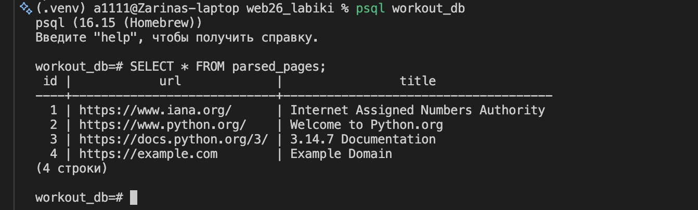
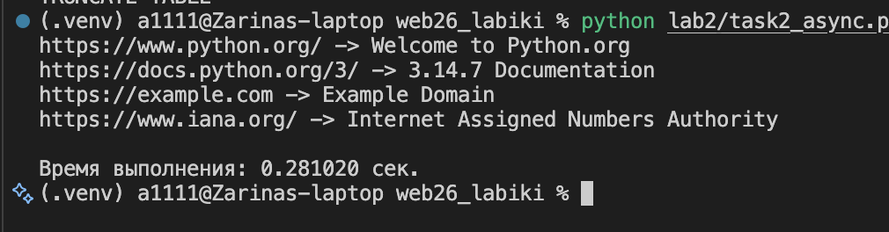
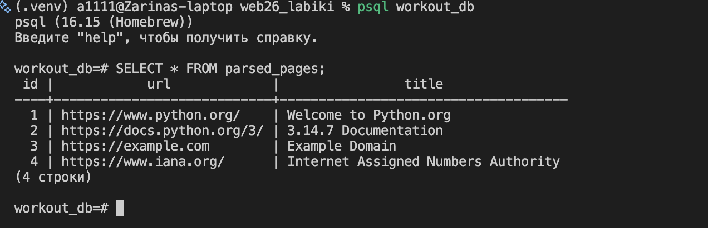

# Лабораторная работа 2. Потоки. Процессы. Асинхронность

## Цель работы

Цель лабораторной работы — изучить различия между потоками, процессами и асинхронным выполнением в Python, а также сравнить их производительность на задачах вычислений и параллельного получения данных из сети.

В ходе работы были реализованы три варианта программ с использованием `threading`, `multiprocessing` и `asyncio`.

---

# Задача 1. Сравнение threading, multiprocessing и async

## Постановка задачи

Необходимо вычислить сумму всех чисел от 1 до `10 000 000 000 000`, разделив вычисление на несколько подзадач.

Для каждого подхода была реализована функция `calculate_sum()`.

Так как последовательный перебор всех десяти триллионов чисел занял бы непрактически большое количество времени, сумма каждого диапазона вычислялась с использованием математической формулы:

$$
S = \frac{(a+b)(b-a+1)}{2}
$$

Диапазон был разделён на четыре части.

## 1. Использование threading

В первом варианте использовался модуль `threading`. Для каждого диапазона создавался отдельный поток. После завершения всех потоков частичные результаты объединялись.

Результат выполнения:



Время выполнения составило **0.000210 с**.

## 2. Использование multiprocessing

Во втором варианте использовался модуль `multiprocessing`. Для выполнения четырёх подзадач был создан пул из четырёх процессов.



Время выполнения составило **0.887820 с**.

## 3. Использование asyncio

В третьем варианте использовался механизм асинхронного выполнения `asyncio`. Для каждого диапазона создавалась асинхронная задача, после чего результаты объединялись с помощью `asyncio.gather()`.


Время выполнения составило **0.000089 с**.

## Сравнение результатов задачи 1

| Подход            | Время выполнения |
| ----------------- | ---------------: |
| `threading`       |       0.000210 с |
| `multiprocessing` |       0.887820 с |
| `asyncio`         |       0.000089 с |

Полученные результаты показывают, что для данной реализации вычисление выполняется очень быстро благодаря использованию математической формулы. Поэтому заметную часть времени составляют накладные расходы на создание и управление потоками и процессами.

В данном эксперименте `multiprocessing` оказался значительно дольше двух других вариантов из-за затрат на создание отдельных процессов. Полученные результаты не означают, что `multiprocessing` в общем случае медленнее: эффективность подхода зависит от характера и объёма выполняемой работы.

---

# Задача 2. Параллельный парсинг веб-страниц

## Постановка задачи

Во второй части лабораторной работы необходимо было получить информацию с нескольких веб-страниц, извлечь их заголовки и сохранить результаты в базу данных PostgreSQL.

Для хранения результатов была создана таблица `parsed_pages`:

```sql
CREATE TABLE parsed_pages (
    id SERIAL PRIMARY KEY,
    url TEXT NOT NULL,
    title TEXT NOT NULL
);
```



Для всех трёх вариантов использовался одинаковый список URL:

```text
https://example.com
https://www.python.org/
https://docs.python.org/3/
https://www.iana.org/
```

Для получения HTML в вариантах `threading` и `multiprocessing` использовалась библиотека `requests`, а для асинхронного варианта — `aiohttp`.

Для извлечения заголовка страницы использовалась библиотека `BeautifulSoup`.

---

## 1. Парсинг с использованием threading

В варианте с `threading` каждый URL обрабатывался отдельным потоком.

Функция `parse_and_save()` выполняла следующие действия:

1. отправляла HTTP-запрос;
2. получала HTML страницы;
3. извлекала заголовок;
4. сохраняла URL и заголовок в PostgreSQL;
5. выводила результат в терминал.



Время выполнения составило **1.959576 с**.

Результаты были сохранены в базу данных.



---

## 2. Парсинг с использованием multiprocessing

В варианте с `multiprocessing` для обработки URL использовался пул процессов.

Каждый процесс получал свой URL, загружал страницу, извлекал заголовок и сохранял результат в базу данных.



Время выполнения составило **0.889360 с**.

Результаты также были сохранены в PostgreSQL.



---

## 3. Парсинг с использованием asyncio

В асинхронном варианте использовалась библиотека `aiohttp`.

Для каждого URL создавалась асинхронная задача, а выполнение всех запросов запускалось с помощью `asyncio.gather()`.



Время выполнения составило **0.281020 с**.

После завершения парсинга в таблице `parsed_pages` были получены четыре записи:



---

## Сравнение результатов задачи 2

| Подход            | Время выполнения |
| ----------------- | ---------------: |
| `threading`       |       1.959576 с |
| `multiprocessing` |       0.889360 с |
| `asyncio`         |       0.281020 с |

В отличие от первой задачи, здесь выполняется большое количество операций ввода-вывода, связанных с получением данных из сети.

В проведённом эксперименте асинхронный вариант показал наименьшее время выполнения. Это связано с тем, что во время ожидания ответа от одного сервера программа может заниматься обработкой других запросов.

`multiprocessing` также позволил выполнять несколько операций параллельно, однако создание и управление отдельными процессами создаёт дополнительные накладные расходы.

`threading` позволил одновременно обрабатывать несколько сетевых запросов, однако в данном запуске его время оказалось больше, чем у двух других вариантов.

Полученные значения относятся именно к проведённому эксперименту и зависят от скорости интернет-соединения, времени ответа серверов и нагрузки на компьютер.

---

# Вывод

В ходе лабораторной работы были изучены три подхода к параллельному и асинхронному выполнению задач в Python: `threading`, `multiprocessing` и `asyncio`.

В первой задаче все три программы вычислили одинаковую сумму чисел от 1 до `10 000 000 000 000`. Во второй задаче каждый подход использовался для параллельного получения данных с веб-страниц и сохранения результатов в PostgreSQL.

Эксперимент показал, что выбор подхода зависит от характера задачи. Для сетевых операций асинхронное выполнение позволяет эффективно использовать время ожидания ответов. `multiprocessing` позволяет выполнять задачи в отдельных процессах, а `threading` — организовать одновременное выполнение нескольких потоков.

Таким образом, были получены практические навыки использования потоков, процессов и асинхронности, а также проведено их сравнение на вычислительной и сетевой задачах.
