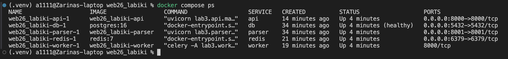
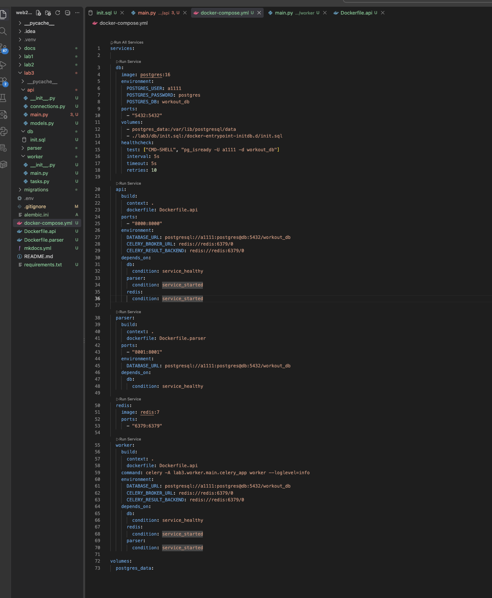
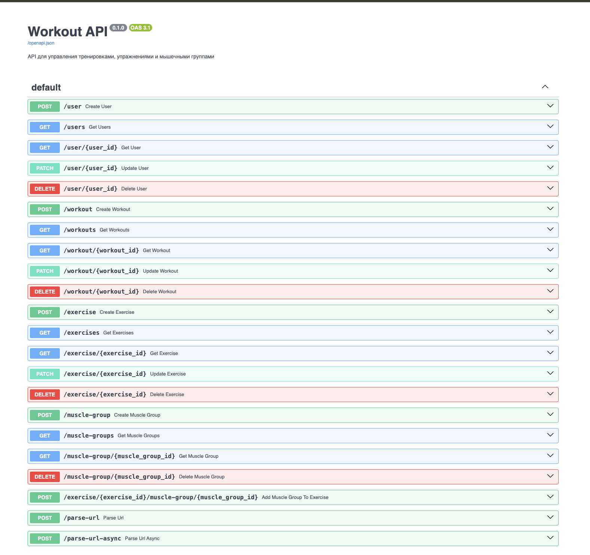
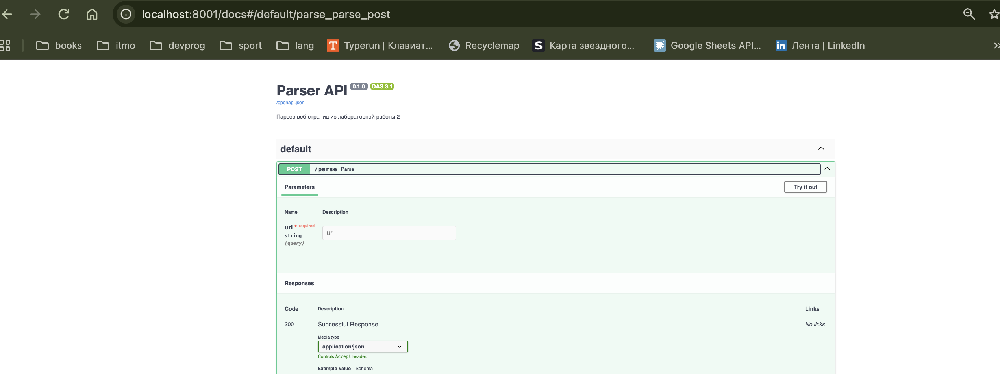
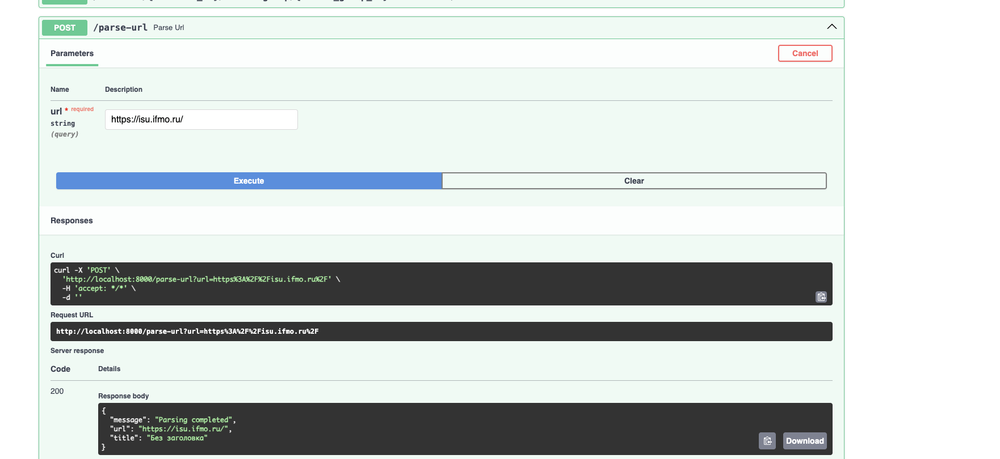
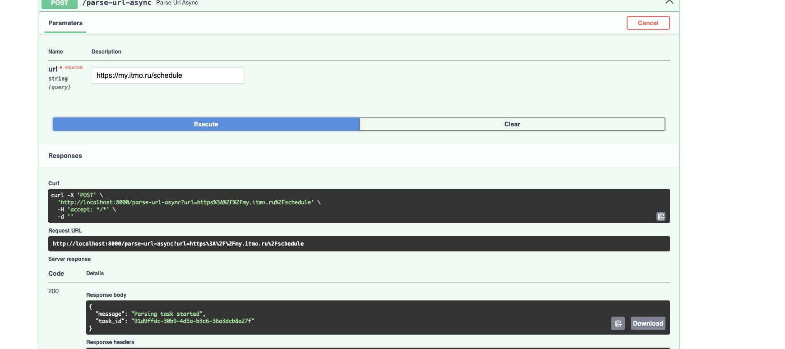
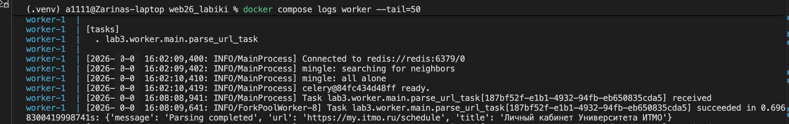

# Лабораторная работа 3

## Упаковка FastAPI приложения в Docker, работа с источниками данных и очереди

### Цель работы

Цель лабораторной работы — научиться упаковывать FastAPI-приложение и связанные с ним сервисы в Docker-контейнеры, организовывать взаимодействие между контейнерами, использовать отдельный сервис для парсинга веб-страниц, а также выполнять обработку задач с помощью очереди Celery и Redis.

В работе используются результаты предыдущих лабораторных работ: FastAPI-приложение и база данных из лабораторной работы 1, а также парсер веб-страниц из лабораторной работы 2.

---

## 1. Упаковка приложения в Docker

На первом этапе существующее FastAPI-приложение и парсер были подготовлены для запуска в Docker-контейнерах. Для основного приложения и парсера созданы отдельные Dockerfile, а взаимодействие всех компонентов организовано с помощью Docker Compose.

В проекте используются следующие сервисы:

* `api` — основное FastAPI-приложение;
* `db` — база данных PostgreSQL;
* `parser` — отдельный сервис для парсинга веб-страниц;
* `redis` — брокер сообщений для очереди;
* `worker` — Celery Worker, выполняющий фоновые задачи.

Для сервисов настроены переменные окружения, зависимости между контейнерами, проброс портов и подключение базы данных через Docker volume.

После запуска Docker Compose все необходимые сервисы успешно запустились. Состояние контейнеров представлено на рисунке 1.



**Рисунок 1 — Состояние контейнеров Docker Compose**

На скриншоте видно, что все пять сервисов находятся в рабочем состоянии. Контейнер базы данных PostgreSQL дополнительно имеет статус `healthy`.

Конфигурация взаимодействия сервисов представлена в файле `docker-compose.yml` (рисунок 2).



**Рисунок 2 — Конфигурация Docker Compose для запуска сервисов лабораторной работы**

В конфигурации описаны PostgreSQL, FastAPI, parser, Redis и Celery Worker, а также их зависимости и параметры подключения.

После запуска контейнера основное FastAPI-приложение доступно через Swagger-документацию. Результат представлен на рисунке 3.



**Рисунок 3 — Swagger-документация основного FastAPI-приложения**

Swagger содержит endpoint'ы из предыдущей лабораторной работы, а также новые endpoint'ы `/parse-url` и `/parse-url-async`, предназначенные для работы с парсером и очередью задач.

Отдельный сервис парсера также запущен в Docker и имеет собственную Swagger-документацию (рисунок 4).



**Рисунок 4 — Swagger-документация отдельного сервиса парсера**

Сервис предоставляет endpoint `POST /parse`, который принимает URL веб-страницы и выполняет её обработку.

---

## 2. Вызов парсера через FastAPI

На втором этапе реализован endpoint `/parse-url`, который принимает URL от клиента и передаёт его отдельному сервису парсера.

Основное FastAPI-приложение отправляет HTTP-запрос в контейнер `parser` по адресу:

```text
http://parser:8001/parse
```

После обработки страницы parser возвращает результат основному API, которое передаёт его клиенту.

Для проверки работы endpoint был выполнен запрос с URL веб-страницы.



**Рисунок 5 — Вызов сервиса парсинга через основной FastAPI API**

В результате был получен HTTP-код `200` и ответ:

```json
{
  "message": "Parsing completed",
  "url": "https://isu.ifmo.ru/",
  "title": "Без заголовка"
}
```

Полученный ответ подтверждает, что основной API успешно передал URL отдельному parser-сервису и получил от него результат обработки.

---

## 3. Использование очереди Celery и Redis

На третьем этапе была добавлена асинхронная обработка задач с использованием Celery и Redis.

Для этого в проект добавлены:

* Redis как брокер сообщений;
* Celery Worker для выполнения фоновых задач;
* задача `parse_url_task`;
* endpoint `/parse-url-async` для постановки задачи в очередь.

Схема обработки запроса имеет следующий вид:

```text
Клиент
   ↓
FastAPI
   ↓
Redis
   ↓
Celery Worker
   ↓
Parser
   ↓
PostgreSQL
```

Для проверки асинхронной обработки через Swagger был выполнен запрос:

```text
POST /parse-url-async
```

с URL:

```text
https://my.itmo.ru/schedule
```

В ответ API вернул идентификатор созданной задачи.



**Рисунок 6 — Постановка задачи парсинга в очередь Celery**

В результате был получен HTTP-код `200` и идентификатор задачи:

```json
{
  "message": "Parsing task started",
  "task_id": "91d9ffdc-30b9-4d5a-b3c6-36a3dcb8a27f"
}
```

Полученный `task_id` подтверждает, что запрос был принят API и задача была создана для последующей фоновой обработки.

После постановки задачи она была получена Celery Worker и успешно выполнена.



**Рисунок 7 — Выполнение задачи парсинга Celery Worker**

В логах Worker отображаются события получения и успешного выполнения задачи `parse_url_task`. Это подтверждает, что задача была передана Worker через очередь и обработана.

Результат обработки сохраняется в базе данных PostgreSQL в таблице `parsed_pages`.


**Рисунок 8 — Результаты парсинга, сохранённые в PostgreSQL**

В таблице отображаются URL обработанной страницы и полученный заголовок. Наличие записей подтверждает, что результат выполнения парсера был сохранён в PostgreSQL.

---

## Вывод

В ходе лабораторной работы существующее FastAPI-приложение было упаковано в Docker и объединено с базой данных PostgreSQL, отдельным сервисом парсинга, Redis и Celery Worker.

Было реализовано взаимодействие основного API с parser-сервисом через HTTP-запрос. Кроме того, добавлена асинхронная обработка URL с использованием Redis и Celery: API создаёт задачу, Worker получает и выполняет её, после чего результат сохраняется в PostgreSQL.

В результате была получена распределённая структура приложения из нескольких взаимодействующих контейнеров, а также освоены основные принципы контейнеризации FastAPI-приложения, взаимодействия сервисов и организации фоновых задач с помощью очереди.
